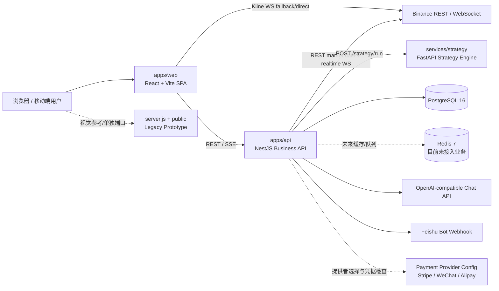
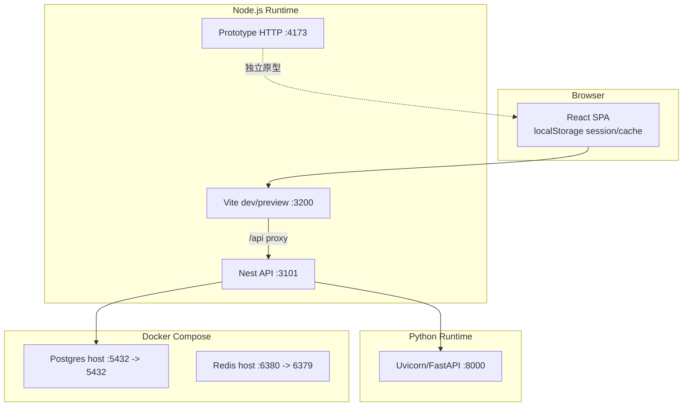
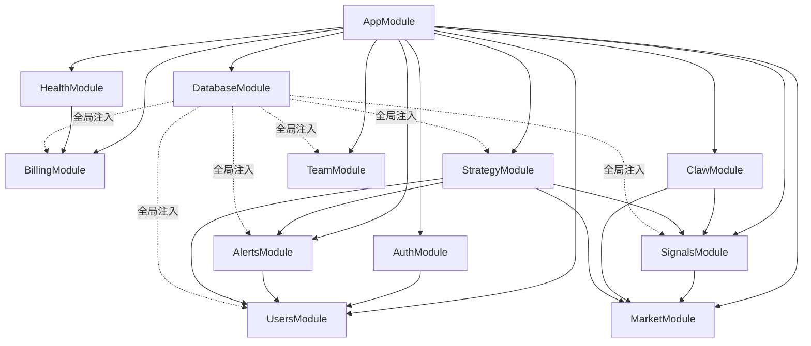
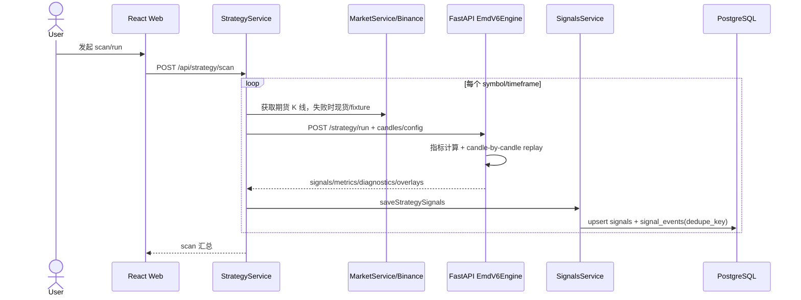
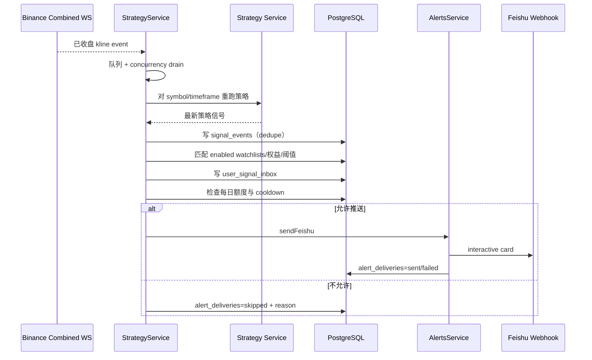
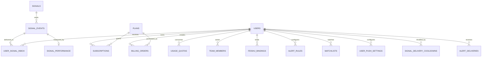

# Coin Anomaly Radar 技术架构

> 文档基线：2026-07-13。内容来自对仓库源码、SQL、配置、脚本和测试的递归核对；`node_modules`、`.venv`、缓存、构建产物、运行日志、图片和压缩包不作为架构事实来源。

## 1. 项目概述

Coin Anomaly Radar（代码中也使用 Radar、Yansir、SignalOS 等名称）是面向加密货币异常监控和策略信号分发的移动优先 Web 产品。当前仓库同时保留两套界面：正式的 React/Vite 应用，以及根目录下用于视觉参考的静态原型。

正式运行链路由以下部分组成：

- `apps/web`：React 18 + Vite 单页应用，承载行情、雷达、信号、ValueClaw、账户、套餐、团队和 K 线实验室。
- `apps/api`：NestJS 10 模块化 API，负责认证、用户、权益、账单、行情聚合、策略编排、信号持久化、飞书推送和团队视图。
- `services/strategy`：FastAPI + Pydantic 策略计算服务，执行逐 K 线 EMD/Pine V6 回放、指标、仓位状态和 TradingView 对齐分析。
- `infra`：PostgreSQL 16、Redis 7、DDL/种子、环境检查、迁移和冒烟脚本。
- `server.js` + `public`：无框架静态原型服务器，不是正式前端入口。

### 实现成熟度

| 能力 | 状态 | 说明 |
|---|---|---|
| Web、API、策略服务 | 已实现 | 可独立启动，API 通过 HTTP 调用策略服务 |
| Binance REST/WS 行情 | 已实现 | API 拉取期货/现货 K 线和 ticker；API 与 K 线实验室使用 WebSocket |
| PostgreSQL 持久化 | 已实现并带内存降级 | 未配置/不可用时多个 Repository 回退到 mock 或进程内数据 |
| Redis | 仅基础设施 | Compose 和环境检查中存在，业务源码尚未接入缓存、队列或分布式锁 |
| Stripe/微信/支付宝 | 配置与抽象已存在 | 当前支付提供者主要生成状态/占位 checkout，未发现完整 SDK 签名与下单实现 |
| 定时扫描/绩效回填 | 已实现但仅进程内 | `setInterval` 驱动，重启丢失，不支持多实例互斥 |
| `scheduled_tasks`、`strategy_runs`、`market_snapshots`、`api_keys`、`audit_logs` | 已建表 | 当前主链路未完整读写或执行 |
| 策略服务自行采集行情 | 未实现 | `market_data.py` 明确抛出 `NotImplementedError`；行情由 API 注入 |

## 2. 总体架构图

## 3. 部署与进程边界

PostgreSQL 的 Compose 主机端口与默认连接串统一使用 `5432`；Redis 仍映射为主机 `6380` 到容器 `6379`。

## 4. 模块关系

## Formal close-confirmed signal pipeline

Binance closed-candle WebSocket events create ordered formal jobs. Each job loads strict authoritative candles ending at the specified close, evaluates the strategy, and append-safely persists a versioned formal event before any user work. Strict inbox matching runs in its own bounded queue and must finish before the close evaluation is marked successful. Initial Feishu sends run in a second bounded queue, so a slow provider cannot hold calculation workers. The pipeline therefore never publishes an intrabar signal or a signal that failed strict persistence.

The calculation and matching queues report separate p50/p95 close latency, queue age, pressure, and failures; stale matching work is a readiness blocker. A reconciler runs every 15 minutes to recover missed close events and prunes completed evaluation state outside its recovery window. A recovered signal can still appear in the inbox, while its push is withheld once its close is over five minutes old. Mock or disconnected database mode is deliberately degraded and non-delivering for formal signals.

Commercial access is enforced after the globally identical formal signal is persisted: Free receives 5m signals after 8 hours with five symbols and seven days of history; VIP receives realtime 5m/15m signals for 50 symbols, 30 days, Feishu, and 300 daily signals; SVIP receives realtime all supported timeframes for 200 symbols, 180 days, Feishu, 2,000 daily signals, and API access.

### API 模块职责

| 模块 | 核心对象 | 职责 |
|---|---|---|
| database | `DatabaseService` | 创建 `pg.Pool`、统一查询、健康检查、退出关闭连接；无 `DATABASE_URL` 时不建池 |
| auth | `AuthController/Service`、token/rate-limit 工具 | 登录、注册、改密、session；密码使用 Node `scrypt`，Bearer token 为 HMAC 签名结构 |
| users | `UsersService/Repository`、`resolveEntitlements` | 用户资料、当前身份、套餐权益、管理员更新；DB 不可用时使用共享 mock |
| billing | `BillingService/Repository`、`PaymentProviders` | 套餐、订单、mock 支付激活、webhook 入口、提供者就绪检查 |
| market | `MarketService`、`MarketStreamService` | Binance REST 行情、fixture 降级、K 线 SSE 代理、市场概览与指标因子 |
| signals | `SignalsService/Repository` | 延迟正式信号列表、仅接受共享正式执行器的严格版本化持久化 |
| alerts | `AlertsService` | 飞书配置、测试/发送、套餐门槛、每日额度、投递历史和 DB 记录 |
| claw | `ClawService` | 组合市场/信号上下文，规则化意图识别，调用 OpenAI-compatible chat completions，失败时模板降级 |
| strategy | `StrategyClient/Service` | 注入行情、调用 Python、扫描、调度、实时 WS、信号分发、自选、公开延迟、绩效回填 |
| team | `TeamService/Repository` | 三级团队仪表板和权益限制 |
| health | `HealthController` | liveness/readiness，检查 DB、策略服务、支付配置 |

### Web 模块

- `AppShell.tsx` 是应用编排中心，同时包含大量页面、数据加载、缓存、路由和展示函数，是当前最大的前端耦合点。
- `BottomNav.tsx` 管理主导航；`viewRouting.ts` 解析查询参数视图；`planAccess.ts` 处理前端权益提示。
- `LiveSignalCommand.tsx` 与 `liveSignalModel.ts` 负责实时雷达视图和模型转换。
- `KlineLabView.tsx`、`klineRealtime.ts`、`klineConfirmation.ts` 负责 K 线实验室、WS 实时更新和已收盘 K 线确认。
- `api.ts` 统一 REST 调用；认证 token 和兼容身份头存储在 `localStorage`。

### Python 策略模块

- `main.py`：仅暴露健康检查和策略运行两个路由。
- `models.py`：K 线、配置、信号、指标、诊断、覆盖物和响应 Pydantic 模型。
- `indicators.py`：SMA、EMA、RMA、TR/ATR、RSI、DMI/ADX、布林宽度、pivot。
- `strategies/emd_v6.py`：`EmdV6Engine` 逐根回放策略、生成信号、风险线、支撑阻力区、面板和时间线。
- `strategies/pine_state.py`：`PinePositionState` 模拟 Pine 多层仓位、开平仓与减仓。
- `parity.py`：规范化 TradingView alert 与本地 timeline，输出缺失、多余和字段不一致。
- `emd_trend.py`：当前入口代理到 `run_emd_v6_strategy`。

## 5. 核心数据流

### 5.1 手动策略扫描

### 5.2 实时信号与用户分发

### 5.3 ValueClaw

用户请求进入 `/api/claw/chat`，服务先读取市场概览和信号形成可信上下文，再用关键词识别 `opportunity/risk/scheduled_task` 等意图。配置 LLM key 时调用 `${OPENAI_BASE_URL}/chat/completions`；超时、响应不合法或无 key 时返回结构化模板，避免完全依赖模型。

### 5.4 账单

订单创建读取用户与套餐，写 `billing_orders(pending)`；本地 mock pay 或通过 secret 保护的 webhook 将订单置为 paid，并创建/更新订阅。支付提供者抽象目前偏“配置就绪与 checkout 占位”，尚不能视为完整生产支付闭环。

### 5.5 Web 数据与降级

Web 启动后并行请求用户、权益、市场、信号、套餐、订单、团队等 API，并在 `localStorage` 保存认证、当前用户、应用数据缓存、扫描历史和自选。API 网络失败时部分页面使用静态数据/缓存；市场服务失败时使用 fixtures；数据库缺失时 Repository 使用内存/mock。该设计便于演示，但会掩盖生产依赖故障。

## 6. API 目录

| 前缀 | 路由概要 |
|---|---|
| `/api/health` | `GET /`、`GET /readiness` |
| `/api/auth` | `POST /login`、`/register`、`/change-password`；`GET /session` |
| `/api` | `GET /me`、`/me/entitlements`、`/admin/users`；`PATCH /admin/users/:userId` |
| `/api/billing` | plans、orders、providers、mock pay、webhook |
| `/api/market` | overview、ticker、klines（klines 可返回 SSE） |
| `/api/signals` | 信号列表 |
| `/api/alerts` | 飞书发送/测试/配置、投递历史 |
| `/api/claw` | chat、status |
| `/api/team` | 团队仪表板 |
| `/api/strategy` | run、scan、scan/alert、规则、自选、inbox、全局/公开信号、调度、realtime、performance |
| `/strategy`（Python） | `GET /health`、`POST /run` |

具体 DTO 与响应样例参见 `docs/API_CONTRACTS.md`；实际路由以 Controller 为准。

## 7. 数据库结构

| 表 | 关键字段与用途 |
|---|---|
| `users` | phone/email 唯一；password_hash、role、status |
| `plans` | 价格、日额度、功能开关、自选上限、周期、延迟、推送阈值/上限 |
| `subscriptions` | user/plan 外键，状态、起止和续费时间；当前没有“每用户仅一个 active”约束 |
| `billing_orders` | provider、金额、状态、checkout/external id、paid/closed 时间 |
| `usage_quotas` | user + quota_key + period_start 唯一 |
| `team_members` | owner/member 双用户关系，组合唯一 |
| `feishu_bindings` | 用户 webhook；user + name 唯一 |
| `alert_rules` | symbols、timeframe、方向、阈值、冷却、扫描间隔；user + name 唯一 |
| `watchlists` | 用户、币种、市场、周期、分数、scope、push 开关；组合唯一 |
| `signals` | 策略信号定义/摘要 |
| `signal_events` | 具体事件，价格、bar/emitted/detected 时间、payload、`strategy_version`、`is_formal`；版本化 `dedupe_key` 唯一，冲突不改写历史 |
| `user_signal_inbox` | 事件匹配用户后的收件箱；user + event 唯一 |
| `signal_performance` | 15m/1h/4h/24h 价格收益、MFE/MAE、状态；事件唯一索引 |
| `user_push_settings` | 渠道开关、目标、最低分、冷却；user + channel 唯一 |
| `signal_delivery_cooldowns` | user/channel/symbol/timeframe/direction/type 唯一 |
| `alert_deliveries` | sent/failed/skipped、HTTP 状态、原因和 payload；事件投递唯一索引 |
| `market_snapshots` | 行情历史快照；目前主链路未持续写入 |
| `strategy_runs` | 策略运行摘要；目前主链路未持续写入 |
| `scheduled_tasks` | 通用用户任务定义；目前没有执行器 |
| `api_keys` | API key hash；目前没有完整鉴权接入 |
| `audit_logs` | 操作审计；目前没有系统性写入 |

数据库依赖 `uuid-ossp`。DDL 使用可重复执行的 `create if not exists` 和追加式 `alter table`，但不是带版本号/回滚的迁移体系。

## 8. 配置项与环境变量

### 核心运行配置

| 变量 | 默认/用途 |
|---|---|
| `NODE_ENV` | production 时收紧 CORS、认证 secret 和 mock 支付规则 |
| `API_PORT` / `WEB_PORT` / `STRATEGY_PORT` / `PORT` | API、Web、策略（脚本使用）和旧原型端口 |
| `DATABASE_URL` | PostgreSQL；缺失时 API 进入无数据库降级 |
| `REDIS_URL` | 部署检查/目标配置；当前业务未读取 Redis 数据 |
| `CORS_ORIGIN` | 逗号分隔白名单；生产未配置时拒绝跨域 |
| `AUTH_TOKEN_SECRET` | Bearer token HMAC secret；生产必须替换 |
| `STRATEGY_SERVICE_URL` | 默认 `http://127.0.0.1:8000` |
| `VITE_API_BASE_URL` | Web REST 基址；空时使用同源 `/api` |
| `VITE_API_PROXY_TARGET` | Vite 开发代理目标，默认 API 3101 |
| `VITE_BASE_PATH` | Vite 构建 base，默认 `/yansir/` |

### 行情与策略

| 变量 | 用途 |
|---|---|
| `BINANCE_FUTURES_BASE_URL` / `BINANCE_SPOT_BASE_URL` | Binance REST 基址 |
| `BINANCE_KLINE_STREAM_BASE_URL` | API SSE 上游 K 线 WS 基址 |
| `BINANCE_REALTIME_STREAM_URL` | 策略全市场实时 WS 基址 |
| `VITE_BINANCE_KLINE_STREAM_URL` | K 线实验室浏览器直连 WS 基址 |
| `MARKET_OVERVIEW_LIMIT` | 市场概览最多处理的 ticker 数 |
| `STRATEGY_REALTIME_CONCURRENCY` | 实时闭合 K 线策略处理并发 |
| `STRATEGY_PERFORMANCE_INTERVAL_SECONDS` | 绩效回填周期 |
| `STRATEGY_PERFORMANCE_BATCH_SIZE` | 每批回填事件数 |

### LLM、告警与支付

| 变量 | 用途 |
|---|---|
| `OPENAI_API_KEY` / `OPENAI_BASE_URL` / `OPENAI_MODEL` | ValueClaw 首选 LLM 配置 |
| `LLM_API_KEY` / `LLM_BASE_URL` / `LLM_MODEL` | 上述配置的兼容别名 |
| `LLM_TIMEOUT_MS` | LLM 请求超时，默认 15000ms |
| `FEISHU_WEBHOOK_URL` | 全局飞书 webhook 回退 |
| `REQUIRE_GLOBAL_FEISHU_WEBHOOK` | 生产就绪检查是否强制全局 webhook |
| `BILLING_PROVIDER` | manual/mock/stripe/wechat/alipay |
| `BILLING_WEBHOOK_SECRET` | webhook 入口共享 secret |
| `STRIPE_SECRET_KEY` | Stripe 准备度检查 |
| `WECHAT_PAY_MCH_ID` / `WECHAT_PAY_API_KEY` | 微信支付准备度检查 |
| `ALIPAY_APP_ID` / `ALIPAY_PRIVATE_KEY` | 支付宝准备度检查 |

### 运维/测试

`API_BASE_URL`、`WEB_BASE_URL`、`E2E_API_BASE_URL`、`E2E_WEB_BASE_URL`、`REQUIRE_PRODUCTION_READY` 用于冒烟、CI 与生产就绪脚本。`.env.local` 可能含真实值，不应进入文档或版本库；本文件只记录变量名。

## 9. 第三方 API

| 集成 | 端点/协议 | 超时与降级 |
|---|---|---|
| Binance Futures REST | `/fapi/v1/ticker/24hr`、`/fapi/v1/exchangeInfo`、`/fapi/v1/klines` | fetch 约 4.5s；概览/K 线可降级为 spot 或 fixture |
| Binance Spot REST | `/api/v3/exchangeInfo`、`/api/v3/klines` | 作为期货失败后的补充 |
| Binance WebSocket | combined kline streams | API SSE 代理、策略实时监听及浏览器 K 线直连；含重连逻辑 |
| Strategy HTTP | `/strategy/health`、`/strategy/run` | readiness 健康检查约 1.5s；策略 client 对非 2xx 抛错 |
| OpenAI-compatible | `/chat/completions` | 默认 15s，失败回退模板；结构化市场数据先于 LLM 生成 |
| Feishu Bot | 用户或全局 webhook | 发送 interactive card，记录 HTTP 状态；注意 webhook 是敏感凭据 |
| 支付渠道 | 当前主要是环境配置与 provider 抽象 | 尚未发现生产 SDK 下单、签名验签和异步对账完整实现 |

## 10. 定时任务、后台任务与流

| 任务 | 实现 | 生命周期/风险 |
|---|---|---|
| 策略计划扫描 | `StrategyService.startScanSchedule` + `setInterval` | 仅内存状态，进程重启消失，多 API 实例会重复执行 |
| 实时 K 线扫描 | Binance WS + 内存队列 + 并发 drain | 启动时可自动拉取 watchlist；断线 5 秒重连；缺少分布式消费协调 |
| 信号绩效回填 | `startPerformanceUpdater` + interval | 启动时按环境配置自动运行，逐事件拉行情并 upsert |
| Web 扫描倒计时/刷新 | React `setInterval` | 仅 UI 状态，不是服务端调度 |
| K 线实验室轮询/重连 | WS + interval/timeout | 具有 API SSE 与 Binance 直连路径，需防重复订阅 |
| 通用 `scheduled_tasks` | 只有表结构和 Claw 意图 | 没有 cron/worker 执行器 |

## 11. 认证、安全与权限

- API 接受 Bearer token，也保留 `x-radar-user-id` 兼容头；后者便利但生产上属于身份伪造风险，应移除或仅限可信内部环境。
- token 为自定义 HMAC 格式，不是标准 JWT；需保证 secret 轮换、过期和撤销机制。
- 密码使用 `scrypt`；登录存在进程内速率限制，但多实例不共享状态。
- CORS 在生产无白名单时关闭，响应设置 nosniff、DENY frame、referrer 和 permissions policy。
- 飞书 webhook 当前以明文存入 `feishu_bindings.webhook_url`，同时 schema 提供 `target_encrypted` 但未形成完整加密密钥方案。
- 支付 webhook 以共享 secret 守护；生产仍需渠道级签名、时间戳、防重放和幂等校验。
- DTO 是普通 TypeScript 类，未发现全局 `ValidationPipe` 和 `class-validator`，边界校验主要在 Service 手工完成。

## 12. 性能瓶颈与风险点

### P0：生产正确性

1. **进程内调度无法水平扩展。** 多实例会重复扫描/推送，重启会丢任务状态。应将任务状态持久化并用 Redis/BullMQ、Postgres advisory lock 或专门 worker 实现单次消费。
2. **兼容身份头可绕过正式认证。** 生产禁用 `x-radar-user-id`，统一 guard 和角色授权；管理员路由需显式 RBAC。
3. **支付闭环不完整。** 在开放真实付款前补齐渠道 SDK、验签、防重放、幂等、退款/关闭、对账和状态机。
4. **降级会掩盖依赖故障。** 生产环境应禁止数据库/行情静默回退为 mock，并让 readiness 明确失败。

### P1：吞吐与稳定性

1. **策略扫描复杂度高。** 每个 symbol × timeframe 都拉取 K 线并执行 Python 全序列回放；全市场运行会造成大量 REST、JSON 序列化和 CPU 开销。应缓存 K 线、增量计算指标、批量/并行调用，并给 Python worker 配置进程池。
2. **N+1 数据库访问。** 实时事件匹配、用户权益、推送设置、冷却、每日额度和 webhook 可能逐用户/逐事件查询。应批量 join 查询、预取权益与设置、一次事务写 inbox/delivery。
3. **大文件高耦合。** `strategy.service.ts` 约 2457 行、`AppShell.tsx` 超 3300 行、`emd_v6.py` 超 1000 行，修改和测试成本高。按扫描、实时、分发、绩效、自选及页面/数据 hook 拆分。
4. **外部 API 缺少统一策略。** Binance、LLM、飞书、策略服务各自管理 timeout/retry；应统一超时、指数退避、熔断、限流、指标和 trace id。
5. **Web 首屏编排过重。** `AppShell` 一次加载多域数据并含大量页面代码；应 route-level lazy loading、请求去重、数据层缓存（如 TanStack Query）和组件分包。

### P2：数据与可维护性

1. DDL 无版本表、回滚和事务化迁移；引入 Prisma/TypeORM migrations、Flyway 或 node-pg-migrate。
2. 多个状态字段是自由字符串，缺少 enum/check；补充 `score` 范围、金额非负、订阅唯一 active 等约束。
3. 部分外键（如 `alert_deliveries.signal_event_id`）未声明 FK；明确删除策略并补齐引用完整性。
4. 高频查询需继续核对复合/部分索引，例如 active subscription、enabled watchlist、pending performance、active alert rule。
5. `localStorage` 保存 bearer token，遭遇 XSS 时可被读取；生产考虑 HttpOnly/SameSite cookie 或短期 access token + refresh rotation。
6. 旧原型、正式 Web 与大量 mockup 并存，容易误改；在仓库导航中明确只将 `apps/web` 视为正式 UI。

## 13. 推荐演进路线

1. **先封住生产风险：** 正式 AuthGuard/RBAC、禁 mock 降级、支付验签、secret 管理、结构化日志与错误追踪。
2. **再解耦执行面：** 将实时扫描、定时扫描、绩效回填和飞书投递迁到 worker/queue，API 只负责命令与查询。
3. **优化策略吞吐：** 行情缓存与增量窗口、批量策略协议、Python 多进程、基准测试和 TradingView parity gate。
4. **优化数据访问：** 批量匹配/投递、事务和幂等、迁移体系、约束及索引。
5. **拆分高耦合文件：** API 按 use case 拆 service；Web 按 feature/router/query hooks 拆；策略按计算阶段拆引擎。
6. **建立可观测性：** scan latency、signals/sec、WS reconnect、queue lag、delivery success、LLM latency/cost、DB pool 和 fallback 次数。

## 14. 测试与验证现状

- API：权益、套餐 E2E、market stream、strategy contract。
- Web：权益、视图路由、触控尺寸、K 线确认/实时/策略源、实时信号命令。
- Python：指标、Pine 状态、EMD V6、模型、TradingView parity。
- 根级 CI：组合构建、权益/E2E 与环境检查。

建议补充：Repository 集成测试、真实 PostgreSQL 事务测试、认证/RBAC 安全测试、支付 webhook 幂等测试、WS 断线/重复事件测试、扫描负载测试和端到端信号投递测试。

## 15. 开发者定位索引

| 需求 | 首要文件 |
|---|---|
| 新增页面/交互 | `apps/web/src/components/AppShell.tsx`，随后迁移到对应 `features` |
| 修改 API 契约 | 对应 `controller.ts`、DTO、service、`docs/API_CONTRACTS.md` |
| 修改套餐权限 | `users/entitlements.ts`、Repository、Web `planAccess.ts`、相关测试 |
| 修改行情 | `market.service.ts`、`market-stream.ts`、market tests |
| 修改策略规则 | `services/strategy/app/strategies/emd_v6.py` + parity/tests |
| 修改扫描/推送 | `strategy.service.ts`、`alerts.service.ts`、schema 和 contract tests |
| 修改数据库 | `infra/schema.sql`、`seed.sql`、Repository，并同步 `docs/DATABASE.md` |
| 修改部署配置 | 根 `.env.example`、`infra/verify-env.mjs`、Compose、README |
